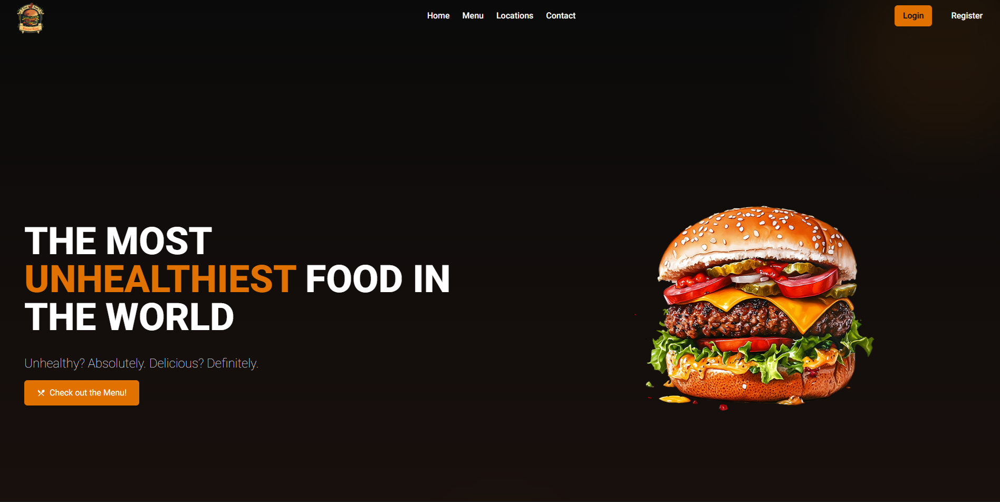

  <h1>🍽️ Restaurant Menu / منوی رستوران</h1>
  
  

    
    
    
  

## ✨ Features / قابلیت‌های کلیدی

📋 **Display menu items** / نمایش لیست غذاها در قالب کارت‌های گریدی  
🔍 **Category filter** / فیلتر بر اساس دسته‌بندی (All, Breakfast, Lunch, Dinner, Sides, Dessert)  
📱 **Fully responsive** / طراحی کاملاً پاسخگو (1-3-6 ستون)  
🎨 **Animated menu tabs** / تب‌های منو با انیمیشن خط زیرین  
🌙 **Dark & warm theme** / تم تیره و گرم با هایلایت امبر  
🔄 **Smooth scrolling** / اسکرول نرم بین بخش‌های صفحه با React Scroll

---

## 📸 Preview / پیش‌نمایش

  

---

## 🛠️ Technologies / فناوری‌های به‌کاررفته

⚛️ **React 18** - Core library / کتابخانه اصلی  
🎨 **TailwindCSS** - Styling / استایل‌دهی  
⚡ **Vite** - Build tool / ابزار ساخت سریع  
📦 **JavaScript (ES6+)** - Application logic / منطق برنامه  
🔄 **React Scroll** - Smooth scrolling / اسکرول نرم بین بخش‌ها

---
